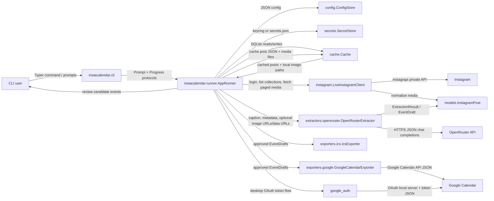

# Instacalendar Architecture

## High-Level System Overview

`instacalendar` is a Python 3.12 command-line application that turns Instagram saved posts into calendar events. Its primary user is a person who saves event posts on Instagram and wants a guided workflow that authenticates once, reviews inferred events, and exports approved events to either an `.ics` file or Google Calendar.

The system is organized as a thin Typer CLI around a testable orchestration layer. The orchestration layer coordinates local configuration, secret lookup, Instagram saved collection fetching or cached post loading, local post/media caching, OpenRouter extraction, human review, calendar export, and SQLite idempotency records. External systems are kept behind small adapters so tests can use fakes and avoid live Instagram, OpenRouter, Google, keyring, or terminal calls.

## Repository Map

```text
.
+-- .github/workflows/          GitHub Actions workflows for lint/test CI and Windows executable builds.
+-- docs/
|   +-- assets/                 Static documentation assets such as the project logo.
|   +-- specs/                  Product notes, implementation plan, and bug investigation notes.
+-- src/instacalendar/          Runtime Python package installed as the `instacalendar` console script.
|   +-- exporters/              Calendar output adapters for `.ics` and Google Calendar.
|   +-- extractors/             Model-backed event extraction adapters.
+-- tests/                      Unit and orchestration tests with mocked external services.
+-- ARCHITECTURE.md             This system architecture guide.
+-- README.md                   User-facing setup, run, privacy, test, and build instructions.
+-- pyproject.toml              Package metadata, runtime dependencies, dev dependencies, and Ruff settings.
+-- uv.lock                     Locked Python dependency graph managed by `uv`.
```

## System Diagram



## System Components & Responsibilities

### `src/instacalendar/cli.py`

Owns the public command surface. It defines the root Typer app, `auth`, `run`, and `cache` commands, plus the default guided wizard path when no subcommand is supplied. It adapts `questionary` prompts and `rich` progress spinners to the `Prompt` and `Progress` protocols consumed by `AppRunner`.

Key technologies: Typer, Questionary, Rich.

### `src/instacalendar/runner.py`

Coordinates the end-to-end workflow. `AppRunner.configure()` gathers and persists account/model/export settings. `AppRunner.run()` initializes cache state, loads configuration and secrets, authenticates Instagram, fetches a saved collection, applies optional post filters, extracts event drafts, prompts for review, exports approved events, and records export idempotency state.

This module is the composition root for runtime adapters. Tests replace `LiveInstagramClient`, `OpenRouterExtractor`, exporters, prompts, and progress objects here.

Key technologies: dataclasses, protocols, `pathlib`, app-local adapters.

### `src/instacalendar/models.py`

Defines the Pydantic contracts shared across adapters:

- `ImageReference`: remote or local image URI and optional MIME type.
- `VideoReference`: remote or local video URI and optional MIME type.
- `InstagramPost`: normalized Instagram media metadata sent to extraction.
- `EventDraft`: candidate event data reviewed by the user and exported.
- `ExtractionResult`: structured model output for one Instagram post.
- `ExportRecord`: typed export metadata contract.

Important validation rules live here: `EventDraft.confidence` must be between 0 and 1, event end time cannot precede start time, and exportability requires a non-empty title and start datetime.

Key technologies: Pydantic v2.

### `src/instacalendar/config.py`

Resolves application paths and stores non-secret configuration. `AppPaths.default()` uses `INSTACALENDAR_HOME` when set; otherwise it uses platform-specific user config and data directories from `platformdirs`. `ConfigStore` reads and writes `config.json`.

Configured values are Instagram username, OpenRouter text model, OpenRouter vision model, default export destination, and optional Google Calendar ID.

Key technologies: platformdirs, Pydantic, JSON files.

### `src/instacalendar/secrets.py`

Stores secret values behind a small `SecretStore` abstraction. It first tries the operating system keyring and falls back to a JSON file under the app config directory when keyring access fails.

Current secret keys are `instagram_password` and `openrouter_api_key`.

Key technologies: keyring, JSON fallback storage.

### `src/instacalendar/cache.py`

Provides local SQLite persistence for cached posts, cached media metadata, review decisions, and export records. It creates four tables:

- `reviews(media_pk, event_index, decision, uid, reviewed_at)`
- `exports(uid, media_pk, event_index, destination_kind, destination_id, remote_event_id, exported_at)`
- `cached_posts(collection_name, media_pk, post_json, fetched_at)`
- `cached_media(collection_name, media_pk, media_kind, media_index, source_url, local_path, status, error)`

`stable_uid()` derives deterministic event UIDs from Instagram media PK, event index, title, and start value. `has_export()` prevents reruns from exporting the same UID to the same destination. Cached posts can be listed by collection and loaded back into `InstagramPost` objects for `--from-cache` runs.

Key technologies: SQLite, SHA-256 stable IDs.

### `src/instacalendar/instagram.py`

Wraps `instagrapi` and maps library media objects to `InstagramPost`. `LiveInstagramClient.authenticate()` loads a saved session file when present, logs in, and writes updated session settings. Saved collections are listed by name. Collection posts are fetched by resolving the collection PK, paging with `collection_medias_v1_chunk`, and retrying transient `ClientError`s.

If the first page fails after retries, the adapter raises `InstagramFetchError`. If a later page fails after some media has already been fetched, it logs a warning and returns the partial set so the run can proceed with available posts.

Key technologies: instagrapi, Python logging.

### `src/instacalendar/extractors/openrouter.py`

Calls OpenRouter's chat completions API. Extraction is text-first: the configured text model receives caption, source URL, taken-at timestamp, and location metadata. If the result is not a confident event and image references are available, the configured vision model receives the same metadata plus image URL content blocks. Local cached image files are encoded as data URLs for vision requests. Cached videos are stored for completeness but are not sent to OpenRouter.

Responses are expected to be JSON objects containing `status`, `confidence`, `events`, and `warnings`. Parsed events are validated as `EventDraft` instances.

Key technologies: httpx, OpenRouter chat completions JSON payloads.

### `src/instacalendar/exporters/ics.py`

Writes approved events to a local `.ics` file. The exporter creates a single iCalendar document with stable UIDs, summary, start/end, location, description, performers, and source URL where available.

Key technologies: icalendar.

### `src/instacalendar/exporters/google.py`

Builds Google Calendar event bodies from `EventDraft` and inserts only when missing. Duplicate detection uses a private extended property named `instacalendar_uid`; `insert_if_missing()` queries that property before calling `events().insert()`.

Timed events use `dateTime` and optional `timeZone`. All-day events use `date`.

Key technologies: Google Calendar API event JSON, private extended properties.

### `src/instacalendar/google_auth.py`

Builds an authenticated Google Calendar v3 service. It loads existing OAuth credentials from the app data directory, refreshes them when possible, or starts an installed-app OAuth local server flow. OAuth client configuration must come from `GOOGLE_OAUTH_CLIENT_JSON` or `GOOGLE_OAUTH_CLIENT_FILE`.

Key technologies: google-auth-oauthlib, google-api-python-client.

## Component Interactions & Data Flow

### Configure Flow

1. A user runs `instacalendar auth` or starts the root guided command.
2. `cli.py` creates `AppRunner(AppPaths.default(), QuestionaryPrompt(), RichProgress())`.
3. `AppRunner.configure()` loads existing config and prompts for missing values.
4. Non-secret values are saved to `config.json`.
5. Instagram password and OpenRouter API key are written through `SecretStore`.
6. If `OPENROUTER_API_KEY` exists, the user is asked whether to use it before being prompted for a typed key.

### Run Flow

1. `AppRunner.run()` initializes the SQLite cache and loads config/secrets.
2. Missing required config raises a runtime error instructing the user to run auth first.
3. Instagram credentials are resolved, and the session file is reused when present.
4. If no collection was passed, Instagram collection names are fetched and the user selects one.
5. Posts are fetched, normalized to `InstagramPost`, optionally filtered by `--posted-since`, then capped by `--limit`.
6. Selected posts are stored in SQLite and their image/video media are downloaded under the app data media directory.
7. Each post is sent to `OpenRouterExtractor.extract()` using local cached images where available.
8. Each returned `EventDraft` receives a stable UID and is skipped if the cache already has an export for the chosen destination.
9. Exportable drafts are shown to the user for approve/skip review.
10. Approved drafts are exported to `.ics` or Google Calendar.
11. Each export is recorded in SQLite using `(uid, destination_kind, destination_id)` as the idempotency key.

### Cached Run Flow

1. `AppRunner.run(from_cache=True)` initializes the cache and loads configuration needed for extraction/export.
2. If no collection was passed, cached collection names are listed and the user selects one.
3. Cached posts are loaded from SQLite and optional `--posted-since` and `--limit` filters are applied.
4. Extraction, review, export, and export idempotency recording proceed like a live run.

Cached runs do not instantiate `LiveInstagramClient`, do not require Instagram credentials, and do not contact Instagram.

There is no asynchronous job queue, pub/sub system, server process, or background worker. The entire run is synchronous and command-scoped.

## Interfaces

### Public CLI Interface

- `instacalendar`: runs the guided wizard, including setup and export.
- `instacalendar auth`: saves Instagram, OpenRouter, export, and optional Google calendar settings.
- `instacalendar run`: executes export with saved configuration and optional `--collection`, `--ics-output`, `--posted-since`, `--limit`, and `--from-cache`.
- `instacalendar cache list-events`: prints recorded exports.
- `instacalendar cache list-posts`: prints cached posts in a multi-column table.
- `instacalendar cache clear --yes`: deletes and reinitializes the local SQLite cache and cached media files.

### Internal Interfaces

- `Prompt` protocol in `runner.py`: `text`, `choose`, and `confirm` methods for terminal-independent prompts.
- `Progress` protocol in `runner.py`: context-manager status reporting.
- Pydantic models in `models.py`: adapter boundary contracts for posts, extraction results, event drafts, and export records.
- `Cache`: the local idempotency boundary used by runner and cache CLI commands.

### External Interfaces

- Instagram via `instagrapi`: login/session settings, saved collection listing, collection PK lookup, and paged media fetches.
- OpenRouter over HTTPS: `POST https://openrouter.ai/api/v1/chat/completions` with bearer token authentication.
- Google OAuth and Calendar API: installed-app OAuth local server flow, credential refresh, calendar event list and insert calls.
- OS keyring: primary storage for secrets when available.
- Local filesystem: config, secret fallback, session, OAuth token, SQLite cache, cached media files, and `.ics` output files.

No webhooks or inbound network API are exposed by this application. The only listener started by the app is the temporary Google OAuth local server during interactive authorization.

## Data Formats & Protocols

- CLI input: Typer options and Questionary interactive prompts.
- Config at rest: JSON in `AppPaths.config_file`, usually `<config-dir>/config.json`.
- Secret fallback at rest: JSON in `AppPaths.secret_fallback_file`, used only when keyring operations fail.
- Instagram session at rest: `instagrapi` settings JSON in `AppPaths.instagram_session_file`.
- Google token at rest: OAuth authorized-user JSON in `AppPaths.google_token_file`.
- Cache at rest: SQLite database in `AppPaths.cache_file`.
- Cached media at rest: files under `AppPaths.media_dir`.
- OpenRouter requests: HTTPS JSON chat completion payloads with text-only or multimodal message content.
- OpenRouter responses: JSON string in `choices[0].message.content`, parsed into `ExtractionResult`.
- ICS export: iCalendar 2.0 bytes written by the `icalendar` package.
- Google export: Google Calendar API JSON event bodies.

## Cross-Cutting Concerns

### Idempotency

The system prevents duplicate exports in two layers. Locally, the SQLite `exports` table keys on UID, destination kind, and destination ID. For Google Calendar, the exporter also queries a private `instacalendar_uid` extended property before inserting, which protects against duplicates when Google already has the event.

### Error Handling

Most adapters let dependency errors surface to the CLI. Current explicit handling is concentrated around known boundaries:

- missing app config produces a clear `RuntimeError`;
- prompt cancellation raises `typer.Abort`;
- invalid CLI dates and export choices raise `typer.BadParameter`;
- repeated first-page Instagram fetch failures become `InstagramFetchError`;
- later-page Instagram fetch failures are logged and return partial results.

OpenRouter JSON parsing, HTTP failures, Google API errors, and filesystem errors are not wrapped with custom domain errors today.

### Logging and Observability

The CLI shows user-facing progress with Rich status messages. The Instagram adapter uses module logging for partial-fetch warnings. There is no structured logging, metrics, tracing, telemetry, or persistent run log.

### Security and Privacy

Secrets are stored in OS keyring when possible, with a plaintext JSON fallback if keyring access fails. The README discloses that Instagram captions, post metadata, and image content for processed posts are sent to OpenRouter, and approved event details are sent to Google when Google export is used.

The app does not store OpenRouter raw responses. It does store cached post metadata, downloaded Instagram media, local review and export metadata, Instagram session settings, and Google OAuth tokens under the user's app directories.

## Deployment & Infrastructure

The application is distributed as a Python package exposing the `instacalendar` console script. Development and test commands use `uv`.

GitHub Actions provides:

- Ubuntu CI on push and pull request: `uv sync --dev`, `uv run ruff check`, and `uv run pytest`.
- Windows executable build on tags matching `v*` or manual dispatch: `uv sync --dev`, PyInstaller one-file build, and artifact upload as `instacalendar.exe`.

There is no hosted backend, database server, container image, serverless deployment, or cloud infrastructure managed by this repository.

## Testing Strategy

Tests live in `tests/` and focus on adapter boundaries plus orchestration behavior:

- `test_models.py`: Pydantic validation, source URL derivation, and exportability rules.
- `test_config.py`: app path overrides and config round trips.
- `test_cache.py`: SQLite initialization, stable UID use, cached post/media round trips, cached post summaries, and export idempotency.
- `test_instagram.py`: image/video media mapping, paged collection fetches, partial failure behavior, and first-page failure errors.
- `test_openrouter.py`: OpenRouter request headers/payloads, local cached image encoding, and JSON response parsing with `respx`.
- `test_ics_exporter.py`: `.ics` UID, location, description, performers, and source URL output.
- `test_google_exporter.py`: duplicate-safe Google Calendar event body construction.
- `test_runner.py`: configuration prompts, environment key use, progress messages, post filtering, and limits with fake adapters.
- `test_cli.py`: CLI command routing, cache behavior, auth config writes, and option validation.

External services are mocked or faked. The current test suite does not perform live Instagram, OpenRouter, Google OAuth, Google Calendar, keyring, or full terminal interaction tests.

## Technical Constraints & Design Decisions

- The project targets Python 3.12 and uses `uv` for dependency management and command execution.
- The CLI is intentionally the only user interface; there is no GUI, daemon, or web app.
- `AppRunner` is the orchestration boundary to keep CLI code thin and tests independent of real terminal widgets.
- Pydantic models define adapter contracts so extractor/exporter tests can validate behavior without live services.
- Extraction is text-first to reduce vision-model calls and only falls back to vision when confidence is low or status is not a confident event.
- Live runs cache selected post metadata plus image/video media locally after post filters are applied. Media download failures are recorded and do not drop the post.
- Vision extraction can use local cached image files by encoding them as data URLs. Cached videos are not analyzed.
- Instagram collection fetching uses lower-level paged chunk calls to avoid earlier `instagrapi` argument compatibility issues and to tolerate later-page 572 errors.
- `.ics` is the only file export format implemented.
- Google export requires a user-provided desktop OAuth client through environment variables; the repository does not ship OAuth client credentials.
- Google scopes currently include both `calendar.events` and full `calendar`, even though narrower scopes may be sufficient for the implemented event insertion flow.

## Known Tech Debt & Future Roadmap

The implementation covers the core v1 flow, but several items from the initial plan remain partial or unimplemented:

- Review is approve/skip only; editing inferred event fields in the CLI is not implemented.
- OpenRouter model discovery and modality validation are not implemented; users provide model IDs directly.
- OpenRouter response handling assumes valid JSON and does not retry malformed model output.
- The extractor does not use a formal JSON Schema beyond `response_format={"type": "json_object"}`.
- SQLite stores cached posts, cached media metadata, reviews, and exports, but not extraction attempts.
- Google calendar selection or creation is not implemented; the app uses configured `google_calendar_id` or `primary`.
- Instagram 2FA/challenge-specific prompt handling is not implemented directly; behavior depends on `instagrapi`.
- Secret fallback storage is plaintext JSON, so environments without a working keyring have weaker local secret protection.
- Full end-to-end manual acceptance is outside the automated test suite.

Future work should preserve the current adapter boundaries: add behavior behind `AppRunner` and the existing Instagram, OpenRouter, cache, and exporter modules rather than moving external-service logic into the CLI.
